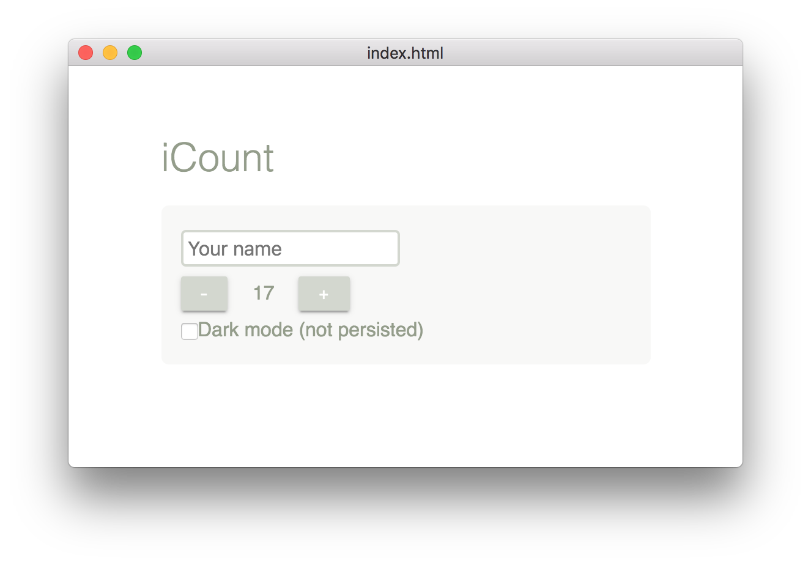

[](https://travis-ci.org/avh4/elm-desktop-app)
[][elm-package]
[][npm-package]


`elm-desktop-app` is the simplest way to write desktop applications in [Elm].
It is built on top of [Electron], and currently supports the following uses:

- Your app can **persist state to disk** as a JSON file
  - automatically to your end user's ["userData" directory](https://electronjs.org/docs/api/app#appgetpathname)
  - to a JSON file specified by your end user
- Build and package **Mac, Linux, and Windows apps**
- (soon) prepare and publish an npm package that can launch your app from the command line


[Elm]: https://elm-lang.org/
[Electron]: https://electronjs.org/
[elm-package]: https://package.elm-lang.org/packages/avh4/elm-desktop-app/latest/
[npm-package]: https://www.npmjs.com/package/elm-desktop-app


## Usage

Use the [`elm-desktop-app`][npm-package] command line tool to create a new project, which includes a dependency on the [`avh4/elm-desktop-app`][elm-package] Elm pacakge and working starting-point for you app:

```sh
npm install -g elm-desktop-app

mkdir my-app
cd my-app
elm-desktop-app init
```

Edit the generated `src/Main.elm` to implement your app and define how to persist data (you can see the [full example code here](https://github.com/avh4/elm-desktop-app/tree/master/example)):

```elm
import DesktopApp

main : Program () (DesktopApp.Model Model) Msg
main =
    DesktopApp.program
        { init = ( init, Cmd.none )
        , update = \msg model -> ( update msg model, Cmd.none )
        , subscriptions = \model -> Sub.none
        , view = view
        , files = files
        , noOp = NoOp
        }
        
type alias Model =
    { name : String
    , count : Int
    }
    
...
    
files : DesktopApp.File Model Msg
files =
    DesktopApp.jsonMapping Loaded
        |> DesktopApp.withString "name" .name
        |> DesktopApp.withInt "count" .count
        |> DesktopApp.jsonFile identity
```

Use the command line tool to run your app:

```sh
elm-desktop-app run
```



The user data for your app is automatically persisted! 💾🎉

You can easily build Mac, Linux, and Windows packages (packages are built to `./elm-stuff/elm-desktop-app/app/dist/`:

```sh
elm-desktop-app package
```
